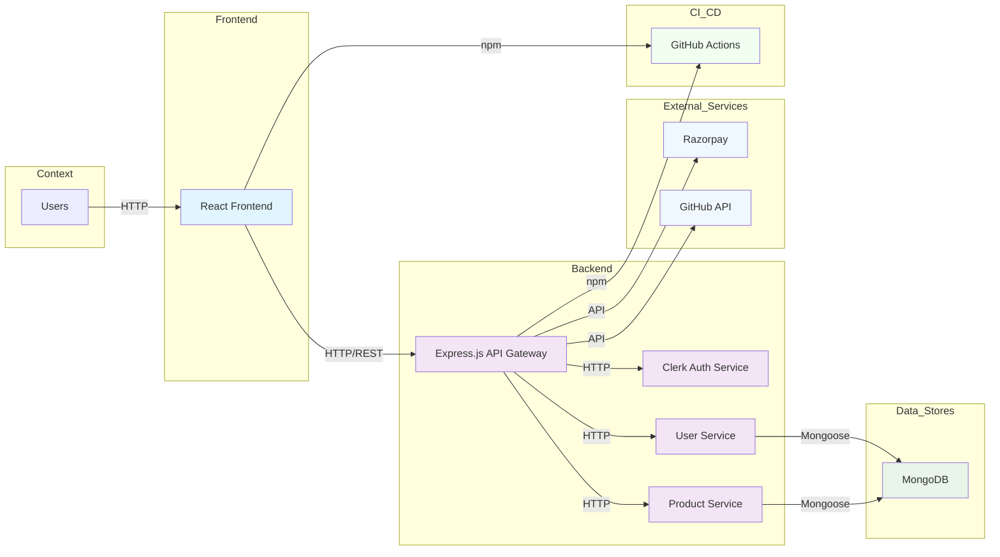

# System Architecture

Below is the system architecture in Mermaid format.

```mermaid
graph LR
    subgraph Context
        User["Users"]
    end

    subgraph Frontend
        ReactApp["React Frontend"]
        style ReactApp fill:#e1f5fe
    end

    subgraph Backend
        API_Gateway["Express.js API Gateway"]
        Auth_Service["Clerk Auth Service"]
        User_Service["User Service"]
        Product_Service["Product Service"]
        style API_Gateway fill:#f3e5f5
        style Auth_Service fill:#f3e5f5
        style User_Service fill:#f3e5f5
        style Product_Service fill:#f3e5f5
    end

    subgraph Data_Stores
        MongoDB["MongoDB"]
        style MongoDB fill:#e8f5e8
    end

    subgraph External_Services
        Razorpay["Razorpay"]
        GitHubAPI["GitHub API"]
        style Razorpay fill:#f0f8ff
        style GitHubAPI fill:#f0f8ff
    end

    subgraph CI_CD
        GitHubActions["GitHub Actions"]
        style GitHubActions fill:#f0fff0
    end


    User -->|HTTP| ReactApp
    ReactApp -->|HTTP/REST| API_Gateway
    API_Gateway -->|HTTP| Auth_Service
    API_Gateway -->|HTTP| User_Service
    API_Gateway -->|HTTP| Product_Service
    User_Service -->|Mongoose| MongoDB
    Product_Service -->|Mongoose| MongoDB
    API_Gateway -->|API| Razorpay
    API_Gateway -->|API| GitHubAPI
    ReactApp -->|npm| GitHubActions
    API_Gateway -->|npm| GitHubActions
```
